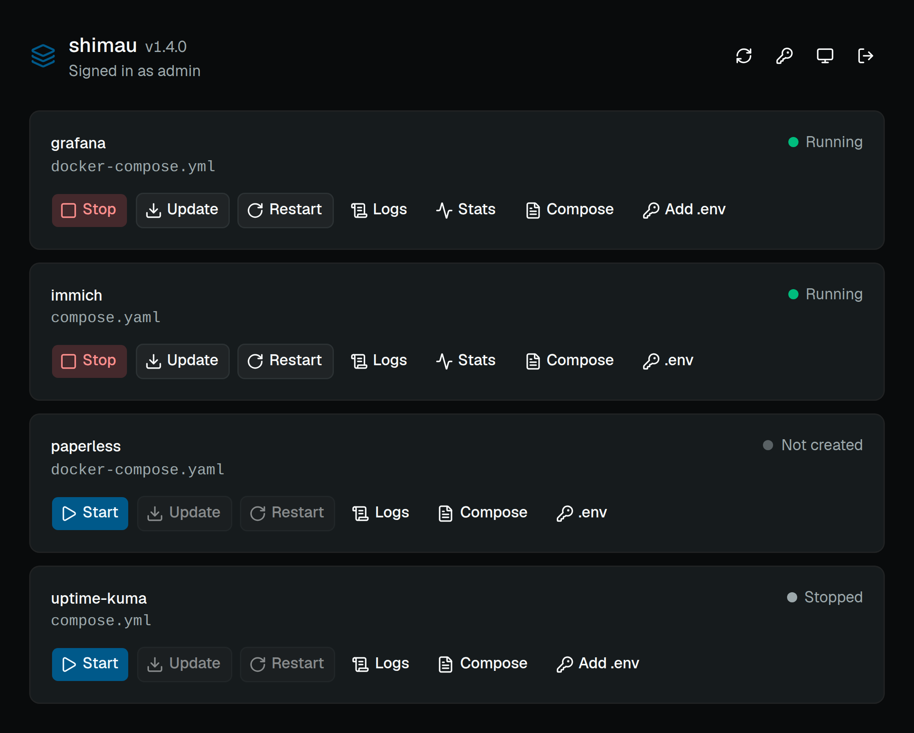
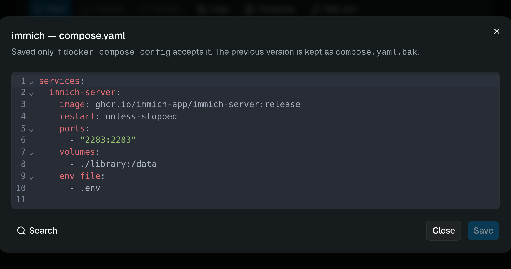
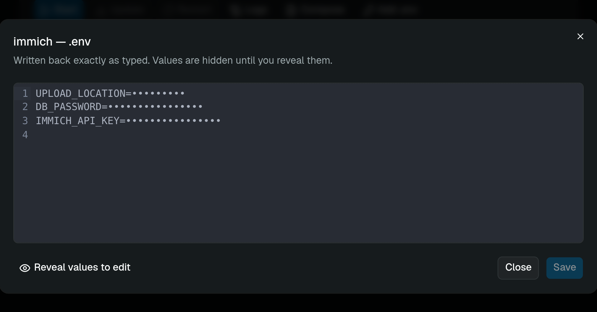

# shimau

**A tiny, modern Docker Compose manager.**

[](https://github.com/dstmrk/shimau/actions/workflows/ci.yml)
[](https://github.com/dstmrk/shimau/pkgs/container/shimau)
[](LICENSE)

shimau gives you a web UI for the Compose projects already sitting on your
server. Start, stop, restart and update them, follow their logs, edit their
`compose.yaml` and `.env` — and nothing else.



Your Compose files stay where they are and stay in charge. shimau reads the
directory, shells out to `docker compose`, and keeps no copy of anything. Its
own database holds one administrator account and its sessions; delete it and
you lose a password, not a deployment.

## What it does

- **Finds your stacks.** Every directory under the configured path holding
  exactly one of `compose.yaml`, `compose.yml`, `docker-compose.yaml` or
  `docker-compose.yml`. The directory name is the stack name.
- **Start · Stop · Restart · Update.** Update is `docker compose pull` followed
  by `docker compose up -d`, nothing cleverer. Stop is `docker compose stop`,
  so containers, networks and volumes survive.
- **Live output.** Long operations stream what Compose is printing, line by
  line, with the exact command at the top so you can reproduce it by hand.
- **Logs.** Followed in real time, and honest about a stack with nothing
  running.
- **Editors.** The Compose file is edited in place, under its own name, and
  only saved if `docker compose config` accepts it — the previous version is
  kept as `<name>.bak`. `.env` opens with its values hidden and read-only until
  you reveal them.

| Compose editor | `.env` editor |
| --- | --- |
|  |  |

## What it will not do

No standalone containers, no Swarm, no Kubernetes, no remote agents, no web
terminal, no `docker compose down`, no image or volume or network management,
no scheduled updates, no metrics, no multiple users. There is no endpoint that
runs a command you hand it.

That list is the product, not a roadmap. If you want a Docker administration
platform, use one.

## Running it

shimau needs a directory of its own, **outside** the one it manages. Put it
inside and shimau discovers itself, and the Stop button turns off the panel you
pressed it from.

```bash
mkdir -p ~/shimau && cd ~/shimau
curl -fsSL -O https://raw.githubusercontent.com/dstmrk/shimau/main/compose.yaml
curl -fsSL -o .env https://raw.githubusercontent.com/dstmrk/shimau/main/.env.example
```

Now edit `.env`. Two lines are required — where your stacks live, and a
password for the first boot:

```bash
SHIMAU_STACKS_DIR=/home/you/docker-apps
SHIMAU_ADMIN_PASSWORD=$(openssl rand -base64 24)
```

`compose.yaml` reads everything from `.env`, so you never have to edit it.

```bash
docker compose up -d
docker compose logs -f shimau
```

Four lines say it came up:

```text
starting shimau version="0.3.0" stacks_dir=/home/you/docker-apps
docker compose available version=5.5.0
administrator account created username=admin
listening address=0.0.0.0:8080
```

The second one is the one to check: it means the Compose plugin inside the
image works, and every action in the UI depends on it.

Open <http://localhost:8080> and sign in.

> **If the login bounces straight back to the form**, with no error, you are
> reaching shimau over plain `http://`. The browser drops the `Secure` session
> cookie on an insecure connection. Set `SHIMAU_COOKIE_SECURE=false` in `.env`
> and `docker compose up -d` again — or put shimau behind TLS, which is the
> better answer for something that controls Docker.

`SHIMAU_ADMIN_PASSWORD` is read once, on the first boot, to create the account.
After that it is ignored and the line can go.

Images are published for `linux/amd64` and `linux/arm64`, one set per
release: `latest` is the newest tagged version, `X.Y.Z` and `X.Y` pin you to
one. Merges to `main` are tested but never published, so `latest` does not
move under you between releases.

### Updating

```bash
cd ~/shimau && docker compose pull && docker compose up -d
```

Your stacks are untouched: shimau keeps nothing about them. Its own database
holds one account and its sessions, in `./data`.

### The one requirement that bites

**The stacks path must be identical inside and outside the container.**

This is why `compose.yaml` writes `SHIMAU_STACKS_DIR` once and uses it twice —
for the container's configuration *and* for the bind mount:

```yaml
environment:
  SHIMAU_STACKS_DIR: ${SHIMAU_STACKS_DIR:?}
volumes:
  - ${SHIMAU_STACKS_DIR:?}:${SHIMAU_STACKS_DIR:?}   # same on both sides
```

Two literal paths could drift apart; one variable cannot. And they must not
drift, because your Compose files use relative bind mounts (`./data:/data`)
that the *host* Docker daemon resolves. Mount your stacks at a different path
inside the container and every relative volume in every managed stack points
somewhere that does not exist.

### Configuration

| Variable | Default | Meaning |
| --- | --- | --- |
| `SHIMAU_STACKS_DIR` | — | **Required.** The directory holding your stacks |
| `SHIMAU_ADMIN_USERNAME` | `admin` | Administrator name, first boot only |
| `SHIMAU_ADMIN_PASSWORD` | — | Bootstrap password, first boot only. At least 12 characters |
| `SHIMAU_DATA_DIR` | `/app/data` | Where `shimau.db` lives |
| `SHIMAU_BIND` | `0.0.0.0:8080` | Listen address |
| `SHIMAU_COOKIE_SECURE` | `true` | Set to `false` only when reaching shimau over plain HTTP |
| `SHIMAU_SESSION_TTL_HOURS` | `168` | Session lifetime |
| `SHIMAU_LOG_TAIL` | `200` | Log lines fetched before following |
| `SHIMAU_LOG` | `info` | `tracing` filter |

If you reach shimau over `http://` and the login form keeps coming back, that
is `SHIMAU_COOKIE_SECURE`: the browser is dropping a `Secure` cookie sent over
an insecure connection.

## Security

shimau controls Docker, which means it is an administrative application.
Treat it as one.

- **Authentication is mandatory** and cannot be turned off. One local account,
  Argon2id, session cookie that is `HttpOnly`, `SameSite=Lax` and `Secure` by
  default. Failed logins back off exponentially per address and username.
- **The Docker socket is a privilege boundary you cannot mount away.** A
  read-only bind of `/var/run/docker.sock` is not a security control. shimau's
  answer is to expose a small closed set of operations rather than a Docker
  API proxy.
- **Nothing from the browser becomes a path.** A stack name goes through a
  character allowlist and then a canonical-path check against the configured
  directory; a symlink pointing out of it is refused.
- **Compose subprocesses get an environment allowlist**, not shimau's own
  environment — otherwise a Compose file could interpolate `${SHIMAU_ADMIN_PASSWORD}`
  and read it back.
- **`.env` content is never logged**, and `.env` and its backup are written
  `0600`. API responses carry `Cache-Control: no-store`, so no proxy or browser
  cache keeps a copy.
- **Every response carries a Content-Security-Policy** with `script-src
  'self'`: no CDN, no inline script, no `eval`. If you put shimau behind a
  proxy that injects its own policy, the stricter of the two wins — a proxy
  policy without `'unsafe-inline'` on `style-src` will break the editors.

Putting shimau behind Cloudflare Access, Tailscale or a VPN is a good idea. It
is a layer on top of shimau's own authentication, not a replacement for it.

## Development

Rust 1.85+ and Node 22+.

```bash
# API on :8080
cd backend
SHIMAU_STACKS_DIR=/path/to/your/stacks \
SHIMAU_DATA_DIR=./data \
SHIMAU_STATIC_DIR=../frontend/dist \
SHIMAU_COOKIE_SECURE=false \
SHIMAU_ADMIN_PASSWORD=dev-password-please \
cargo run

# UI on :5173, proxying /api to :8080
cd frontend
npm install
npm run dev
```

Tests:

```bash
cd backend && cargo test          # unit + HTTP suite
cd frontend && npm run test       # Vitest
node scripts/check-docs.mjs       # documentation references
```

The Compose validation tests shell out to `docker compose config`, which needs
the CLI but not a running daemon. Without the CLI they skip themselves.

`docs/spec.md` is the specification the project is built from, `CLAUDE.md` and
`docs/architecture/INDEX.md` are the map for whoever — or whatever — works on
it next.

## Why it exists

The name is しまう — Japanese for putting something away, stowing it where it
belongs. That is the job: your Compose projects, tidy and reachable, owned by
the filesystem rather than by shimau.

Dockge had the right core idea: a file-based, Compose-focused UI that does not
try to replace the whole Docker administration ecosystem. shimau keeps that
idea, cuts the feature set further, and rebuilds it on Rust and React.

## Licence

MIT. See `LICENSE`.
